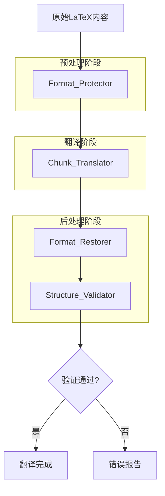
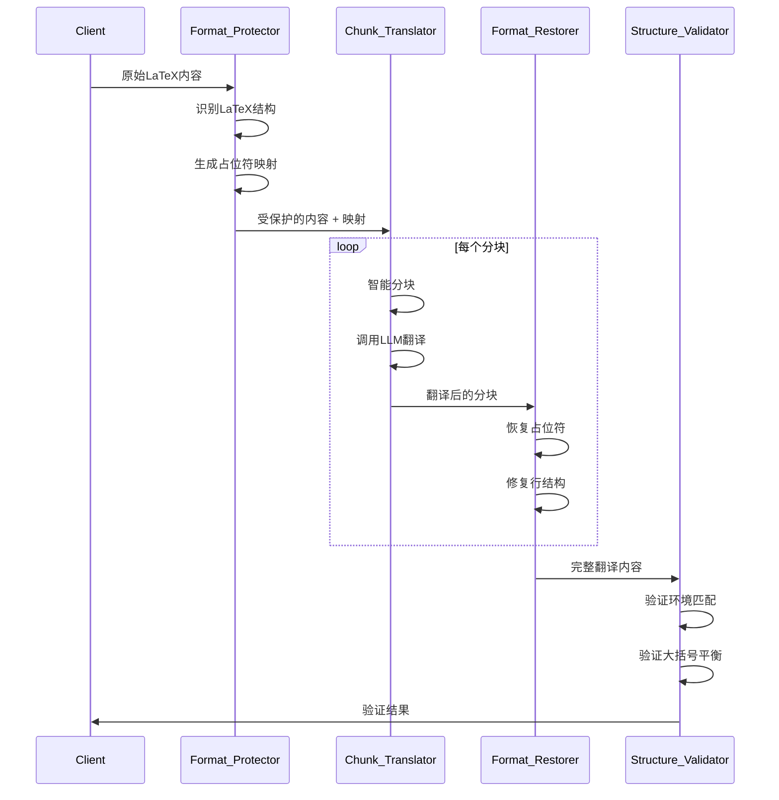
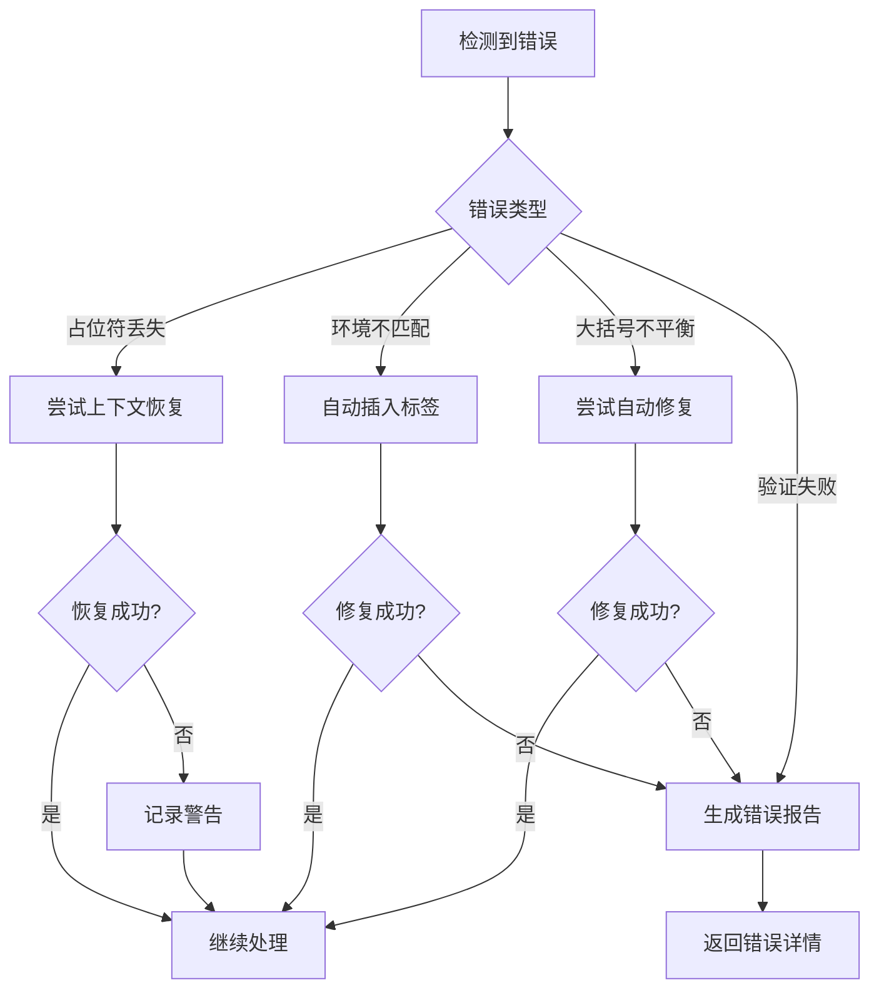

# Design Document: LaTeX Format Preservation

## Overview

本设计文档描述了一个多层次的LaTeX格式保护系统，用于在LLM翻译过程中保持LaTeX文档的结构完整性。系统采用"保护-翻译-验证-恢复"的流水线架构，通过预处理、智能分块、后处理和验证四个阶段来最大程度地减少格式损坏。

### 设计目标

1. **最小化格式损坏**: 通过占位符系统保护关键LaTeX结构
2. **智能错误恢复**: 自动检测和修复常见的LLM格式错误
3. **结构验证**: 在翻译后验证文档结构的完整性
4. **可扩展性**: 支持添加新的保护规则和恢复策略

## Architecture

系统采用流水线架构，包含以下主要组件：



### 组件交互



## Components and Interfaces

### 1. Format_Protector (格式保护器)

负责在翻译前识别和保护LaTeX结构。

```go
// FormatProtector 格式保护器接口
type FormatProtector interface {
    // ProtectContent 保护LaTeX内容，返回受保护的内容和占位符映射
    ProtectContent(content string) (protected string, placeholders map[string]string)
    
    // IdentifyStructures 识别所有LaTeX结构
    IdentifyStructures(content string) []LaTeXStructure
    
    // ProtectMathEnvironments 保护数学环境
    ProtectMathEnvironments(content string) (string, map[string]string)
    
    // ProtectTableStructures 保护表格结构
    ProtectTableStructures(content string) (string, map[string]string)
}

// LaTeXStructure 表示一个LaTeX结构
type LaTeXStructure struct {
    Type       StructureType // 结构类型：命令、环境、数学等
    Name       string        // 结构名称
    Start      int           // 起始位置
    End        int           // 结束位置
    Content    string        // 原始内容
    IsNested   bool          // 是否嵌套
    ParentType string        // 父结构类型
}

// StructureType 结构类型枚举
type StructureType int

const (
    StructureCommand     StructureType = iota // \command{...}
    StructureEnvironment                       // \begin{...}...\end{...}
    StructureMathInline                        // $...$
    StructureMathDisplay                       // \[...\] 或 $$...$$
    StructureTable                             // 表格环境
    StructureComment                           // % 注释
)
```

### 2. Placeholder_System (占位符系统)

管理占位符的生成、存储和恢复。

```go
// PlaceholderSystem 占位符系统接口
type PlaceholderSystem interface {
    // GeneratePlaceholder 生成唯一占位符
    GeneratePlaceholder(structureType StructureType) string
    
    // StorePlaceholder 存储占位符映射
    StorePlaceholder(placeholder string, original string)
    
    // RestorePlaceholder 恢复单个占位符
    RestorePlaceholder(content string, placeholder string) string
    
    // RestoreAll 恢复所有占位符
    RestoreAll(content string) string
    
    // ValidatePlaceholders 验证所有占位符是否存在于内容中
    ValidatePlaceholders(content string) []string // 返回丢失的占位符
}

// PlaceholderConfig 占位符配置
type PlaceholderConfig struct {
    Prefix    string // 占位符前缀，默认 "<<<LATEX_"
    Suffix    string // 占位符后缀，默认 ">>>"
    Separator string // 类型和编号分隔符，默认 "_"
}
```

### 3. Chunk_Translator (分块翻译器)

负责智能分块和调用LLM进行翻译。

```go
// ChunkTranslator 分块翻译器接口
type ChunkTranslator interface {
    // SplitIntoChunks 智能分块
    SplitIntoChunks(content string, maxSize int) []Chunk
    
    // TranslateChunk 翻译单个分块
    TranslateChunk(chunk Chunk) (translated string, err error)
    
    // ReassembleChunks 重新组装分块
    ReassembleChunks(chunks []TranslatedChunk) string
    
    // GetOptimalChunkSize 获取最优分块大小
    GetOptimalChunkSize(content string) int
}

// Chunk 表示一个内容分块
type Chunk struct {
    Index       int    // 分块索引
    Content     string // 分块内容
    StartLine   int    // 起始行号
    EndLine     int    // 结束行号
    HasComplete bool   // 是否包含完整环境
    Boundaries  []int  // 安全边界位置
}

// ChunkBoundary 分块边界类型
type ChunkBoundary int

const (
    BoundaryParagraph ChunkBoundary = iota // 段落边界
    BoundarySectionEnd                      // 章节结束
    BoundaryEnvironmentEnd                  // 环境结束
    BoundaryTableEnd                        // 表格结束
)
```

### 4. Structure_Validator (结构验证器)

验证翻译后的LaTeX结构完整性。

```go
// StructureValidator 结构验证器接口
type StructureValidator interface {
    // ValidateEnvironments 验证环境匹配
    ValidateEnvironments(content string) *EnvironmentValidation
    
    // ValidateBraces 验证大括号平衡
    ValidateBraces(content string) *BraceValidation
    
    // ValidateComments 验证注释格式
    ValidateComments(original, translated string) *CommentValidation
    
    // CompareStructure 比较原始和翻译后的结构
    CompareStructure(original, translated string) *StructureComparison
    
    // FullValidation 执行完整验证
    FullValidation(original, translated string) *ValidationResult
}

// EnvironmentValidation 环境验证结果
type EnvironmentValidation struct {
    IsValid      bool
    Environments map[string]EnvCount // 环境名 -> 计数
    Mismatches   []EnvMismatch       // 不匹配的环境
}

// EnvCount 环境计数
type EnvCount struct {
    BeginCount int
    EndCount   int
}

// EnvMismatch 环境不匹配信息
type EnvMismatch struct {
    EnvName    string
    Expected   int
    Actual     int
    Difference int
}

// BraceValidation 大括号验证结果
type BraceValidation struct {
    IsBalanced   bool
    OpenCount    int
    CloseCount   int
    Difference   int
    ErrorLocations []int // 可能的错误位置
}

// ValidationResult 完整验证结果
type ValidationResult struct {
    IsValid            bool
    EnvironmentResult  *EnvironmentValidation
    BraceResult        *BraceValidation
    CommentResult      *CommentValidation
    StructureResult    *StructureComparison
    Errors             []string
    Warnings           []string
}
```

### 5. Format_Restorer (格式恢复器)

负责修复翻译后的格式问题。

```go
// FormatRestorer 格式恢复器接口
type FormatRestorer interface {
    // RestoreLineStructure 恢复行结构
    RestoreLineStructure(translated, original string) string
    
    // RestoreEnvironments 恢复环境标签
    RestoreEnvironments(translated, original string) string
    
    // RestoreBraces 恢复大括号平衡
    RestoreBraces(translated, original string) string
    
    // RestoreComments 恢复注释格式
    RestoreComments(translated, original string) string
    
    // ApplyAllFixes 应用所有修复
    ApplyAllFixes(translated, original string) string
}

// FixRule 修复规则
type FixRule struct {
    Name        string         // 规则名称
    Pattern     *regexp.Regexp // 匹配模式
    Replacement string         // 替换内容
    Priority    int            // 优先级
    Enabled     bool           // 是否启用
}

// FixResult 修复结果
type FixResult struct {
    Original    string
    Fixed       string
    RulesApplied []string
    ChangeCount  int
}
```

## Data Models

### 翻译上下文

```go
// TranslationContext 翻译上下文
type TranslationContext struct {
    OriginalContent    string                 // 原始内容
    ProtectedContent   string                 // 受保护的内容
    Placeholders       map[string]string      // 占位符映射
    Chunks             []Chunk                // 分块列表
    TranslatedChunks   []TranslatedChunk      // 翻译后的分块
    ValidationResult   *ValidationResult      // 验证结果
    Metadata           *TranslationMetadata   // 元数据
}

// TranslationMetadata 翻译元数据
type TranslationMetadata struct {
    OriginalLineCount    int
    TranslatedLineCount  int
    OriginalCharCount    int
    TranslatedCharCount  int
    ChineseCharCount     int
    PlaceholderCount     int
    EnvironmentCount     map[string]int
    ProcessingTime       time.Duration
}

// TranslatedChunk 翻译后的分块
type TranslatedChunk struct {
    Chunk
    TranslatedContent string
    TokensUsed        int
    FixesApplied      []string
}
```

### 配置模型

```go
// FormatPreservationConfig 格式保护配置
type FormatPreservationConfig struct {
    // 保护设置
    ProtectMath          bool     // 保护数学环境
    ProtectTables        bool     // 保护表格
    ProtectComments      bool     // 保护注释
    ProtectedCommands    []string // 额外保护的命令
    
    // 分块设置
    MaxChunkSize         int      // 最大分块大小
    ChunkOverlap         int      // 分块重叠大小
    RespectEnvironments  bool     // 尊重环境边界
    
    // 验证设置
    StrictValidation     bool     // 严格验证模式
    MinLengthRatio       float64  // 最小长度比
    MaxLengthRatio       float64  // 最大长度比
    MinChineseRatio      float64  // 最小中文比例
    
    // 恢复设置
    AutoFixLineStructure bool     // 自动修复行结构
    AutoFixBraces        bool     // 自动修复大括号
    AutoFixEnvironments  bool     // 自动修复环境
    
    // Prompt设置
    IncludeExamples      bool     // 在prompt中包含示例
    StrictLineCount      bool     // 要求严格行数匹配
}

// DefaultConfig 返回默认配置
func DefaultConfig() *FormatPreservationConfig {
    return &FormatPreservationConfig{
        ProtectMath:          true,
        ProtectTables:        true,
        ProtectComments:      true,
        ProtectedCommands:    []string{},
        MaxChunkSize:         4000,
        ChunkOverlap:         100,
        RespectEnvironments:  true,
        StrictValidation:     false,
        MinLengthRatio:       0.3,
        MaxLengthRatio:       3.0,
        MinChineseRatio:      0.05,
        AutoFixLineStructure: true,
        AutoFixBraces:        true,
        AutoFixEnvironments:  true,
        IncludeExamples:      true,
        StrictLineCount:      true,
    }
}
```


## Correctness Properties

*A property is a characteristic or behavior that should hold true across all valid executions of a system—essentially, a formal statement about what the system should do. Properties serve as the bridge between human-readable specifications and machine-verifiable correctness guarantees.*

### Property 1: Placeholder Round-Trip

*For any* LaTeX content containing commands, protecting the content with placeholders and then restoring the placeholders SHALL produce content equivalent to the original.

**Validates: Requirements 1.2**

### Property 2: Math Environment Protection

*For any* LaTeX content containing mathematical expressions (inline `$...$` or display `\[...\]`), the Format_Protector SHALL identify and protect each complete mathematical expression as a single unit, with no partial expressions.

**Validates: Requirements 1.3**

### Property 3: Table Structure Protection

*For any* LaTeX content containing table environments, the Format_Protector SHALL protect the entire table structure including all `\multirow`, `\multicolumn`, cell separators (`&`), and row terminators (`\\`).

**Validates: Requirements 1.4**

### Property 4: Line Count Preservation

*For any* LaTeX content, after translation and format restoration, the translated content SHALL have the same number of lines as the original content (within a tolerance of ±5%).

**Validates: Requirements 2.1**

### Property 5: Line Structure Preservation

*For any* LaTeX content containing `\begin{...}`, `\end{...}`, or `\item` commands, after format restoration, each of these commands SHALL appear on its own separate line.

**Validates: Requirements 2.2, 2.3, 2.4, 2.5**

### Property 6: Environment Counting Accuracy

*For any* LaTeX content, the Structure_Validator SHALL correctly count all `\begin{env}` and `\end{env}` pairs, and the counts SHALL match the actual occurrences in the content.

**Validates: Requirements 3.1**

### Property 7: Environment Mismatch Detection

*For any* LaTeX content with mismatched `\begin` and `\end` tags, the Structure_Validator SHALL detect the mismatch and report the specific environment name and count difference.

**Validates: Requirements 3.2**

### Property 8: Missing End Tag Restoration

*For any* LaTeX content where an `\end{...}` tag is missing, the Format_Restorer SHALL insert the missing tag at a position that maintains valid LaTeX structure.

**Validates: Requirements 3.3**

### Property 9: Nested Environment Validation

*For any* LaTeX content with nested environments, the Structure_Validator SHALL verify that inner environments are completely contained within outer environments (proper nesting order).

**Validates: Requirements 3.5**

### Property 10: Brace Balance Validation

*For any* LaTeX content, the Structure_Validator SHALL correctly count opening `{` and closing `}` braces, including nested braces at all levels.

**Validates: Requirements 4.1, 4.4**

### Property 11: Brace Imbalance Location

*For any* LaTeX content with brace imbalance, the Structure_Validator SHALL identify the approximate location (line number or character position) of the imbalance.

**Validates: Requirements 4.2**

### Property 12: Multirow/Multicolumn Brace Fix

*For any* LaTeX content containing `\multirow` or `\multicolumn` commands with missing closing braces, the Format_Restorer SHALL add the missing braces to complete the command.

**Validates: Requirements 4.3**

### Property 13: Brace Restoration

*For any* translated LaTeX content where the brace count differs from the original, the Format_Restorer SHALL attempt to restore the original brace balance.

**Validates: Requirements 4.5**

### Property 14: Comment Line Protection

*For any* LaTeX content, lines starting with `%` SHALL be identified as comment lines, and any `\begin{...}` or `\end{...}` within comments SHALL remain commented after processing.

**Validates: Requirements 5.1, 5.4**

### Property 15: Comment Symbol Preservation

*For any* comment line in LaTeX content, after translation, the `%` symbol SHALL be preserved at the beginning of the line.

**Validates: Requirements 5.2**

### Property 16: Comment Restoration

*For any* LaTeX content where the LLM removes the `%` symbol from a comment line or uncomments a commented environment tag, the Format_Restorer SHALL restore the comment marker.

**Validates: Requirements 5.3, 5.5**

### Property 17: Chunk Boundary Respect

*For any* LaTeX content being split into chunks, chunk boundaries SHALL NOT fall within an environment (between `\begin{...}` and `\end{...}`).

**Validates: Requirements 6.1, 6.2**

### Property 18: Table Chunking

*For any* LaTeX content containing tables, if the table size is within the maximum chunk size, the entire table SHALL be kept in a single chunk.

**Validates: Requirements 6.3**

### Property 19: Safe Boundary Splitting

*For any* chunk that exceeds the maximum size, the split SHALL occur at a safe boundary (paragraph break, section end, or environment end).

**Validates: Requirements 6.4**

### Property 20: Chunk Reassembly Round-Trip

*For any* LaTeX content, splitting into chunks and then reassembling SHALL produce content identical to the original (no duplication or loss).

**Validates: Requirements 6.5**

### Property 21: Structure Comparison

*For any* original and translated LaTeX content pair, the Structure_Validator SHALL compare and report differences in document structure (sections, environments, commands).

**Validates: Requirements 7.1**

### Property 22: Length Ratio Validation

*For any* translated content with length ratio outside the acceptable range (< 0.3 or > 3.0 of original), the Structure_Validator SHALL flag it as potentially problematic.

**Validates: Requirements 7.2**

### Property 23: Required Pattern Validation

*For any* original LaTeX content containing required patterns (like `\documentclass`), the translated content SHALL also contain these patterns.

**Validates: Requirements 7.3**

### Property 24: Chinese Ratio Validation

*For any* translated content with Chinese character ratio below 5% (for substantial content > 1000 chars), the Structure_Validator SHALL warn that translation may have failed.

**Validates: Requirements 7.5**

### Property 25: Post-Processing Application

*For any* translated chunk, the Format_Restorer SHALL apply all enabled post-processing fixes before returning the result.

**Validates: Requirements 9.1**

### Property 26: Line Break Insertion

*For any* translated content where `\end{env}` and `\item` are on the same line, or `\caption{...}` is followed by `\begin{tabular}` on the same line, or table row separators are followed by `\midrule` on the same line, the Format_Restorer SHALL insert appropriate line breaks.

**Validates: Requirements 9.2, 9.3, 9.4**

### Property 27: Reference-Based Fixing

*For any* translated content, when comparing with the original content, the Format_Restorer SHALL use the original structure as reference to fix structural issues.

**Validates: Requirements 9.5**

## Error Handling

### 错误类型

1. **PlaceholderLostError**: 占位符在翻译过程中丢失
   - 处理策略: 尝试从上下文恢复，或记录警告并继续

2. **EnvironmentMismatchError**: 环境标签不匹配
   - 处理策略: 自动插入缺失的标签，或报告错误位置

3. **BraceImbalanceError**: 大括号不平衡
   - 处理策略: 尝试自动修复，或报告可能的错误位置

4. **ChunkBoundaryError**: 分块边界落在不安全位置
   - 处理策略: 扩展分块以包含完整环境

5. **ValidationError**: 翻译结果验证失败
   - 处理策略: 返回详细错误信息，建议手动检查

### 错误恢复流程



## Testing Strategy

### 单元测试

单元测试用于验证各个组件的基本功能：

1. **Format_Protector 测试**
   - 测试各类LaTeX命令的识别
   - 测试占位符生成的唯一性
   - 测试数学环境的完整保护

2. **Structure_Validator 测试**
   - 测试环境计数的准确性
   - 测试大括号平衡检测
   - 测试嵌套验证

3. **Format_Restorer 测试**
   - 测试行结构修复
   - 测试大括号修复
   - 测试注释恢复

### 属性测试

属性测试使用 Go 的 `testing/quick` 包或第三方库如 `gopter` 进行：

**配置要求**:
- 每个属性测试至少运行 100 次迭代
- 使用随机生成的LaTeX内容进行测试
- 每个测试标注对应的设计属性

**测试标签格式**: `Feature: latex-format-preservation, Property N: [property_text]`

### 关键属性测试

1. **Property 1: Placeholder Round-Trip**
   ```go
   // Feature: latex-format-preservation, Property 1: Placeholder Round-Trip
   func TestPlaceholderRoundTrip(t *testing.T) {
       // 生成随机LaTeX内容
       // 保护 -> 恢复 -> 验证等于原始
   }
   ```

2. **Property 5: Line Structure Preservation**
   ```go
   // Feature: latex-format-preservation, Property 5: Line Structure Preservation
   func TestLineStructurePreservation(t *testing.T) {
       // 生成包含\begin, \end, \item的内容
       // 处理后验证每个命令在单独行
   }
   ```

3. **Property 20: Chunk Reassembly Round-Trip**
   ```go
   // Feature: latex-format-preservation, Property 20: Chunk Reassembly Round-Trip
   func TestChunkReassemblyRoundTrip(t *testing.T) {
       // 生成随机LaTeX内容
       // 分块 -> 重组 -> 验证等于原始
   }
   ```

### 集成测试

集成测试验证完整的翻译流水线：

1. **端到端翻译测试**
   - 使用真实的arXiv论文片段
   - 验证翻译后的LaTeX可以编译

2. **格式保护集成测试**
   - 测试完整的保护-翻译-恢复流程
   - 验证各组件的协作

### 测试数据

使用以下类型的测试数据：

1. **合成数据**: 随机生成的LaTeX结构
2. **真实数据**: 从arXiv论文提取的片段
3. **边界情况**: 特别设计的边界测试用例
