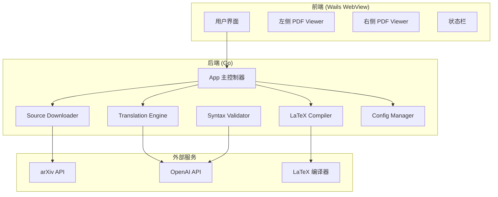
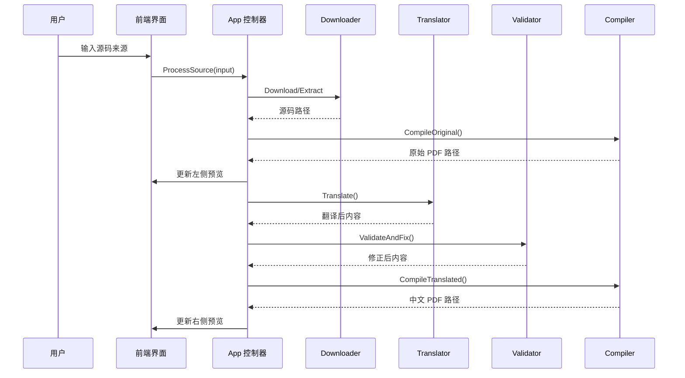

# 设计文档

## 概述

LaTeX 翻译器是一个基于 Go + Wails 的桌面应用程序，采用前后端分离架构。后端使用 Go 处理核心业务逻辑（下载、翻译、编译），前端使用 Web 技术（HTML/CSS/JavaScript）实现用户界面。系统通过 Wails 框架实现前后端通信。

## 架构

### 系统架构图



### 处理流程图



## 组件和接口

### 1. App 主控制器

```go
// App 是 Wails 应用的主控制器
type App struct {
    ctx           context.Context
    config        *ConfigManager
    downloader    *SourceDownloader
    translator    *TranslationEngine
    compiler      *LaTeXCompiler
    validator     *SyntaxValidator
    workDir       string
}

// ProcessSource 处理输入源并启动完整流程
func (a *App) ProcessSource(input string) (*ProcessResult, error)

// GetStatus 获取当前处理状态
func (a *App) GetStatus() *Status

// CancelProcess 取消当前处理
func (a *App) CancelProcess() error
```

### 2. Source Downloader

```go
// SourceDownloader 负责下载和解压 LaTeX 源码
type SourceDownloader struct {
    httpClient *http.Client
    workDir    string
}

// DownloadFromURL 从 arXiv URL 下载源码
func (d *SourceDownloader) DownloadFromURL(url string) (*SourceInfo, error)

// DownloadByID 通过 arXiv ID 下载源码
func (d *SourceDownloader) DownloadByID(arxivID string) (*SourceInfo, error)

// ExtractZip 解压本地 zip 文件
func (d *SourceDownloader) ExtractZip(zipPath string) (*SourceInfo, error)

// FindMainTexFile 在目录中查找主 tex 文件
func (d *SourceDownloader) FindMainTexFile(dir string) (string, error)
```

### 3. Translation Engine

```go
// TranslationEngine 负责调用 OpenAI API 进行翻译
type TranslationEngine struct {
    apiKey    string
    client    *openai.Client
    model     string
}

// TranslateTeX 翻译 LaTeX 文档内容
func (t *TranslationEngine) TranslateTeX(content string) (*TranslationResult, error)

// TranslateChunk 翻译单个文本块（保留 LaTeX 命令）
func (t *TranslationEngine) TranslateChunk(chunk string) (string, error)
```

### 4. Syntax Validator

```go
// SyntaxValidator 负责检测和修正 LaTeX 语法
type SyntaxValidator struct {
    apiKey string
    client *openai.Client
}

// Validate 检测 LaTeX 语法错误
func (v *SyntaxValidator) Validate(content string) (*ValidationResult, error)

// Fix 修正 LaTeX 语法错误
func (v *SyntaxValidator) Fix(content string, errors []SyntaxError) (string, error)
```

### 5. LaTeX Compiler

```go
// LaTeXCompiler 负责编译 LaTeX 文档
type LaTeXCompiler struct {
    compiler    string // "pdflatex" 或 "xelatex"
    workDir     string
    timeout     time.Duration
}

// Compile 编译 tex 文件生成 PDF
func (c *LaTeXCompiler) Compile(texPath string, outputDir string) (*CompileResult, error)

// CompileWithXeLaTeX 使用 xelatex 编译（用于中文）
func (c *LaTeXCompiler) CompileWithXeLaTeX(texPath string, outputDir string) (*CompileResult, error)
```

### 6. Config Manager

```go
// ConfigManager 负责管理应用配置
type ConfigManager struct {
    configPath string
    config     *Config
}

// Load 加载配置
func (m *ConfigManager) Load() error

// Save 保存配置
func (m *ConfigManager) Save() error

// GetAPIKey 获取 OpenAI API 密钥
func (m *ConfigManager) GetAPIKey() string

// SetAPIKey 设置 OpenAI API 密钥
func (m *ConfigManager) SetAPIKey(key string) error
```

## 数据模型

```go
// Config 应用配置
type Config struct {
    OpenAIAPIKey    string `json:"openai_api_key"`
    OpenAIModel     string `json:"openai_model"`
    DefaultCompiler string `json:"default_compiler"` // "pdflatex" 或 "xelatex"
    WorkDirectory   string `json:"work_directory"`
}

// SourceInfo 源码信息
type SourceInfo struct {
    SourceType  SourceType `json:"source_type"` // URL, ArxivID, LocalZip
    OriginalRef string     `json:"original_ref"`
    ExtractDir  string     `json:"extract_dir"`
    MainTexFile string     `json:"main_tex_file"`
    AllTexFiles []string   `json:"all_tex_files"`
}

// SourceType 源码类型枚举
type SourceType string

const (
    SourceTypeURL      SourceType = "url"
    SourceTypeArxivID  SourceType = "arxiv_id"
    SourceTypeLocalZip SourceType = "local_zip"
)

// TranslationResult 翻译结果
type TranslationResult struct {
    OriginalContent   string `json:"original_content"`
    TranslatedContent string `json:"translated_content"`
    TokensUsed        int    `json:"tokens_used"`
}

// ValidationResult 语法验证结果
type ValidationResult struct {
    IsValid bool          `json:"is_valid"`
    Errors  []SyntaxError `json:"errors"`
}

// SyntaxError 语法错误
type SyntaxError struct {
    Line    int    `json:"line"`
    Column  int    `json:"column"`
    Message string `json:"message"`
    Type    string `json:"type"`
}

// CompileResult 编译结果
type CompileResult struct {
    Success   bool   `json:"success"`
    PDFPath   string `json:"pdf_path"`
    Log       string `json:"log"`
    ErrorMsg  string `json:"error_msg,omitempty"`
}

// ProcessResult 处理结果
type ProcessResult struct {
    OriginalPDFPath   string `json:"original_pdf_path"`
    TranslatedPDFPath string `json:"translated_pdf_path"`
    SourceInfo        *SourceInfo `json:"source_info"`
}

// Status 处理状态
type Status struct {
    Phase       ProcessPhase `json:"phase"`
    Progress    int          `json:"progress"` // 0-100
    Message     string       `json:"message"`
    Error       string       `json:"error,omitempty"`
}

// ProcessPhase 处理阶段枚举
type ProcessPhase string

const (
    PhaseIdle        ProcessPhase = "idle"
    PhaseDownloading ProcessPhase = "downloading"
    PhaseExtracting  ProcessPhase = "extracting"
    PhaseCompiling   ProcessPhase = "compiling"
    PhaseTranslating ProcessPhase = "translating"
    PhaseValidating  ProcessPhase = "validating"
    PhaseComplete    ProcessPhase = "complete"
    PhaseError       ProcessPhase = "error"
)
```


## 正确性属性

*正确性属性是一种应该在系统所有有效执行中保持为真的特征或行为——本质上是关于系统应该做什么的形式化陈述。属性作为人类可读规范和机器可验证正确性保证之间的桥梁。*

### Property 1: arXiv ID 到 URL 转换正确性

*对于任意* 有效的 arXiv ID（新格式如 "2301.00001" 或旧格式如 "hep-th/9901001"），构建的下载 URL 应该符合 arXiv 的 e-print 源码下载格式 `https://arxiv.org/e-print/{id}`。

**Validates: Requirements 1.2**

### Property 2: Zip 解压完整性（往返属性）

*对于任意* 包含 LaTeX 源码的 zip 文件，解压后的文件集合应该与原始 zip 中的文件集合完全一致（文件名和内容均相同）。

**Validates: Requirements 1.3**

### Property 3: 主 tex 文件识别

*对于任意* 包含 `\documentclass` 命令的 tex 文件集合，FindMainTexFile 函数应该返回包含该命令的文件路径。

**Validates: Requirements 1.5**

### Property 4: LaTeX 命令保留（翻译不变量）

*对于任意* 包含 LaTeX 命令（如 `\section{}`, `\begin{}`, `$...$`）的文本，翻译后的文本中所有 LaTeX 命令和数学公式应该保持不变，仅纯文本内容被翻译。

**Validates: Requirements 3.2**

### Property 5: 输入类型识别

*对于任意* 输入字符串，系统应该正确识别其类型：
- 以 `http://` 或 `https://` 开头且包含 `arxiv` → URL 类型
- 匹配 arXiv ID 格式（`\d{4}\.\d{4,5}` 或 `[a-z-]+/\d{7}`）→ ArxivID 类型
- 以 `.zip` 结尾的本地路径 → LocalZip 类型

**Validates: Requirements 5.1, 5.2, 5.3**

### Property 6: 配置加载往返

*对于任意* 有效的 Config 对象，保存到文件后再加载应该得到等价的 Config 对象。

**Validates: Requirements 6.1**

### Property 7: 中文文档编译器选择

*对于任意* 包含中文字符的 tex 文件，编译时应该自动选择 xelatex 编译器。

**Validates: Requirements 2.5**

## 错误处理

### 错误类型定义

```go
// AppError 应用错误
type AppError struct {
    Code    ErrorCode `json:"code"`
    Message string    `json:"message"`
    Details string    `json:"details,omitempty"`
    Cause   error     `json:"-"`
}

// ErrorCode 错误代码枚举
type ErrorCode string

const (
    ErrNetwork       ErrorCode = "NETWORK_ERROR"
    ErrDownload      ErrorCode = "DOWNLOAD_ERROR"
    ErrExtract       ErrorCode = "EXTRACT_ERROR"
    ErrFileNotFound  ErrorCode = "FILE_NOT_FOUND"
    ErrInvalidInput  ErrorCode = "INVALID_INPUT"
    ErrAPICall       ErrorCode = "API_CALL_ERROR"
    ErrAPIRateLimit  ErrorCode = "API_RATE_LIMIT"
    ErrCompile       ErrorCode = "COMPILE_ERROR"
    ErrConfig        ErrorCode = "CONFIG_ERROR"
    ErrInternal      ErrorCode = "INTERNAL_ERROR"
)
```

### 错误处理策略

| 错误场景 | 处理方式 | 用户提示 |
|---------|---------|---------|
| 网络连接失败 | 重试 3 次，间隔递增 | "网络连接失败，请检查网络后重试" |
| arXiv 下载失败 | 返回错误，允许重试 | "下载失败：{具体原因}" |
| Zip 解压失败 | 返回错误 | "解压失败：文件可能已损坏" |
| 找不到主 tex 文件 | 返回错误 | "未找到主 LaTeX 文件" |
| OpenAI API 调用失败 | 重试 2 次 | "翻译服务暂时不可用，请稍后重试" |
| API 速率限制 | 等待后重试 | "请求过于频繁，正在等待..." |
| LaTeX 编译失败 | 返回编译日志 | "编译失败，请查看错误日志" |
| 配置文件无效 | 使用默认配置 | "配置文件无效，已使用默认配置" |

### 日志记录

```go
// Logger 日志接口
type Logger interface {
    Debug(msg string, fields ...Field)
    Info(msg string, fields ...Field)
    Warn(msg string, fields ...Field)
    Error(msg string, err error, fields ...Field)
}
```

所有错误都会被记录到日志文件，包含：
- 时间戳
- 错误级别
- 错误代码
- 错误消息
- 堆栈跟踪（仅 Error 级别）

## 测试策略

### 双重测试方法

本项目采用单元测试和属性测试相结合的方式：

- **单元测试**：验证特定示例、边界情况和错误条件
- **属性测试**：验证所有输入的通用属性

### 属性测试配置

- 使用 Go 的 `testing/quick` 包或 `gopter` 库进行属性测试
- 每个属性测试最少运行 100 次迭代
- 每个测试必须用注释标注对应的设计属性
- 标注格式：**Feature: latex-translator, Property {number}: {property_text}**

### 测试覆盖范围

| 组件 | 单元测试 | 属性测试 |
|-----|---------|---------|
| SourceDownloader | URL 解析、ID 验证 | Property 1, 2, 3 |
| TranslationEngine | API 调用模拟 | Property 4 |
| LaTeXCompiler | 编译器选择逻辑 | Property 7 |
| ConfigManager | 配置读写 | Property 6 |
| InputParser | 输入类型判断 | Property 5 |

### 测试示例

```go
// Feature: latex-translator, Property 1: arXiv ID 到 URL 转换正确性
func TestArxivIDToURL(t *testing.T) {
    f := func(id ArxivID) bool {
        url := BuildArxivURL(id)
        return strings.HasPrefix(url, "https://arxiv.org/e-print/") &&
               strings.Contains(url, string(id))
    }
    if err := quick.Check(f, nil); err != nil {
        t.Error(err)
    }
}

// Feature: latex-translator, Property 4: LaTeX 命令保留
func TestLaTeXCommandPreservation(t *testing.T) {
    f := func(text TextWithLaTeX) bool {
        translated := mockTranslate(text)
        return extractLaTeXCommands(text) == extractLaTeXCommands(translated)
    }
    if err := quick.Check(f, nil); err != nil {
        t.Error(err)
    }
}
```

### 集成测试

集成测试需要实际的外部依赖：
- arXiv API 连接测试
- OpenAI API 连接测试
- LaTeX 编译器安装验证

这些测试应该在 CI/CD 环境中单独运行，并可以通过环境变量跳过。
