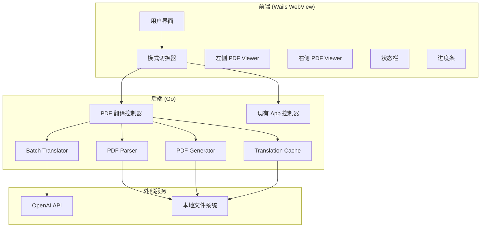
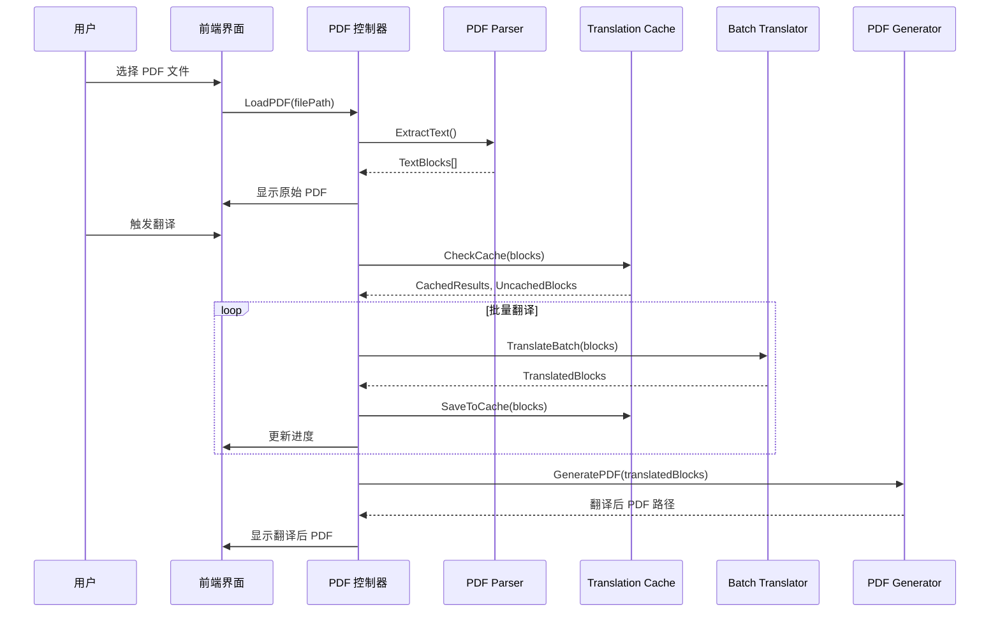

# 设计文档

## 概述

PDF 翻译功能是 LaTeX 翻译器的扩展模块，采用与现有系统一致的 Go + Wails 架构。该功能通过提取 PDF 中的文本内容，使用大语言模型进行批量翻译，然后生成保持原始布局的中文 PDF。系统采用批量合并翻译策略和并发处理来提升翻译效率。

## 架构

### 系统架构图



### 处理流程图



## 组件和接口

### 1. PDF 翻译控制器

```go
// PDFTranslator 是 PDF 翻译功能的主控制器
type PDFTranslator struct {
    ctx           context.Context
    config        *config.Config
    parser        *PDFParser
    translator    *BatchTranslator
    generator     *PDFGenerator
    cache         *TranslationCache
    workDir       string
    currentFile   string
    status        *PDFStatus
}

// LoadPDF 加载 PDF 文件并提取文本
func (p *PDFTranslator) LoadPDF(filePath string) (*PDFInfo, error)

// TranslatePDF 翻译 PDF 内容
func (p *PDFTranslator) TranslatePDF() (*TranslationResult, error)

// GetStatus 获取当前处理状态
func (p *PDFTranslator) GetStatus() *PDFStatus

// CancelTranslation 取消翻译
func (p *PDFTranslator) CancelTranslation() error

// GetTranslatedPDFPath 获取翻译后 PDF 路径
func (p *PDFTranslator) GetTranslatedPDFPath() string
```

### 2. PDF Parser

```go
// PDFParser 负责解析 PDF 并提取文本
type PDFParser struct {
    workDir string
}

// ExtractText 从 PDF 中提取文本块
func (p *PDFParser) ExtractText(pdfPath string) ([]TextBlock, error)

// GetPDFInfo 获取 PDF 基本信息
func (p *PDFParser) GetPDFInfo(pdfPath string) (*PDFInfo, error)

// IsTextPDF 检查 PDF 是否包含可提取的文本
func (p *PDFParser) IsTextPDF(pdfPath string) (bool, error)
```

### 3. Batch Translator

```go
// BatchTranslator 负责批量翻译文本
type BatchTranslator struct {
    apiKey        string
    baseURL       string
    model         string
    contextWindow int
    concurrency   int
    client        *http.Client
}

// TranslateBatch 批量翻译文本块
func (b *BatchTranslator) TranslateBatch(blocks []TextBlock) ([]TranslatedBlock, error)

// MergeBatches 将文本块合并为批次
func (b *BatchTranslator) MergeBatches(blocks []TextBlock) [][]TextBlock

// TranslateWithRetry 带重试的翻译
func (b *BatchTranslator) TranslateWithRetry(batch []TextBlock, maxRetries int) ([]TranslatedBlock, error)
```

### 4. PDF Generator

```go
// PDFGenerator 负责生成翻译后的 PDF
type PDFGenerator struct {
    workDir    string
    fontPath   string
}

// GeneratePDF 生成翻译后的 PDF
func (g *PDFGenerator) GeneratePDF(originalPath string, blocks []TranslatedBlock, outputPath string) error

// OverlayText 在原始 PDF 上覆盖翻译文本
func (g *PDFGenerator) OverlayText(page int, block TranslatedBlock) error

// AdjustTextSize 根据空间自动调整文本大小
func (g *PDFGenerator) AdjustTextSize(text string, maxWidth, maxHeight float64) (float64, error)
```

### 5. Translation Cache

```go
// TranslationCache 负责缓存翻译结果
type TranslationCache struct {
    cachePath string
    cache     map[string]string // hash -> translation
    mu        sync.RWMutex
}

// Get 获取缓存的翻译
func (c *TranslationCache) Get(text string) (string, bool)

// Set 设置翻译缓存
func (c *TranslationCache) Set(text, translation string)

// ComputeHash 计算文本哈希
func (c *TranslationCache) ComputeHash(text string) string

// Load 从文件加载缓存
func (c *TranslationCache) Load() error

// Save 保存缓存到文件
func (c *TranslationCache) Save() error

// FilterCached 过滤出已缓存和未缓存的文本块
func (c *TranslationCache) FilterCached(blocks []TextBlock) (cached []TranslatedBlock, uncached []TextBlock)
```

## 数据模型

```go
// PDFInfo PDF 文件信息
type PDFInfo struct {
    FilePath   string  `json:"file_path"`
    FileName   string  `json:"file_name"`
    PageCount  int     `json:"page_count"`
    FileSize   int64   `json:"file_size"`
    IsTextPDF  bool    `json:"is_text_pdf"`
}

// TextBlock 文本块
type TextBlock struct {
    ID         string   `json:"id"`
    Page       int      `json:"page"`
    Text       string   `json:"text"`
    X          float64  `json:"x"`
    Y          float64  `json:"y"`
    Width      float64  `json:"width"`
    Height     float64  `json:"height"`
    FontSize   float64  `json:"font_size"`
    FontName   string   `json:"font_name"`
    IsBold     bool     `json:"is_bold"`
    IsItalic   bool     `json:"is_italic"`
    BlockType  string   `json:"block_type"` // paragraph, heading, caption, etc.
}

// TranslatedBlock 翻译后的文本块
type TranslatedBlock struct {
    TextBlock
    TranslatedText string `json:"translated_text"`
    FromCache      bool   `json:"from_cache"`
}

// TranslationBatch 翻译批次
type TranslationBatch struct {
    Blocks     []TextBlock `json:"blocks"`
    TotalChars int         `json:"total_chars"`
    BatchIndex int         `json:"batch_index"`
}

// PDFStatus PDF 处理状态
type PDFStatus struct {
    Phase           PDFPhase `json:"phase"`
    Progress        int      `json:"progress"`
    Message         string   `json:"message"`
    TotalBlocks     int      `json:"total_blocks"`
    CompletedBlocks int      `json:"completed_blocks"`
    CachedBlocks    int      `json:"cached_blocks"`
    Error           string   `json:"error,omitempty"`
}

// PDFPhase PDF 处理阶段
type PDFPhase string

const (
    PDFPhaseIdle        PDFPhase = "idle"
    PDFPhaseLoading     PDFPhase = "loading"
    PDFPhaseExtracting  PDFPhase = "extracting"
    PDFPhaseTranslating PDFPhase = "translating"
    PDFPhaseGenerating  PDFPhase = "generating"
    PDFPhaseComplete    PDFPhase = "complete"
    PDFPhaseError       PDFPhase = "error"
)

// TranslationResult 翻译结果
type TranslationResult struct {
    OriginalPDFPath    string `json:"original_pdf_path"`
    TranslatedPDFPath  string `json:"translated_pdf_path"`
    TotalBlocks        int    `json:"total_blocks"`
    TranslatedBlocks   int    `json:"translated_blocks"`
    CachedBlocks       int    `json:"cached_blocks"`
    TokensUsed         int    `json:"tokens_used"`
}

// CacheEntry 缓存条目
type CacheEntry struct {
    Hash        string    `json:"hash"`
    Original    string    `json:"original"`
    Translation string    `json:"translation"`
    CreatedAt   time.Time `json:"created_at"`
}

// CacheFile 缓存文件结构
type CacheFile struct {
    Version string       `json:"version"`
    Entries []CacheEntry `json:"entries"`
}
```


## 正确性属性

*正确性属性是一种应该在系统所有有效执行中保持为真的特征或行为——本质上是关于系统应该做什么的形式化陈述。属性作为人类可读规范和机器可验证正确性保证之间的桥梁。*

### Property 1: PDF 加载有效性

*对于任意* 有效的 PDF 文件路径，LoadPDF 函数应该成功返回 PDFInfo 对象；对于任意无效或不存在的文件路径，应该返回明确的错误。

**Validates: Requirements 1.1, 1.3**

### Property 2: 文本块数据完整性

*对于任意* 从 PDF 提取的 TextBlock，应该包含有效的位置信息（X, Y, Width, Height >= 0）、页码（Page > 0）、非空文本内容和 BlockType 属性。

**Validates: Requirements 1.4, 2.2, 2.3**

### Property 3: 文本提取非空性

*对于任意* 包含可选文本的 PDF 文件，ExtractText 函数返回的 TextBlock 列表长度应该大于 0。

**Validates: Requirements 2.1**

### Property 4: 特殊字符保留

*对于任意* 包含数学公式或特殊符号的文本块，提取后的文本应该保持原始字符不变（字符集保留不变量）。

**Validates: Requirements 2.5**

### Property 5: 批次大小约束

*对于任意* 由 MergeBatches 函数生成的批次，每个批次的总字符数应该小于配置的上下文窗口大小，且所有批次的文本块总数应该等于输入的文本块总数。

**Validates: Requirements 3.1, 3.2**

### Property 6: 翻译结果映射

*对于任意* 翻译批次，翻译后返回的 TranslatedBlock 数量应该等于输入的 TextBlock 数量，且每个 TranslatedBlock 的 ID 应该与对应输入块的 ID 一致。

**Validates: Requirements 3.3**

### Property 7: 状态有效性

*对于任意* 处理过程中的状态更新，PDFStatus 的 Phase 应该是有效的 PDFPhase 枚举值，Progress 应该在 0-100 范围内，且 CompletedBlocks <= TotalBlocks。

**Validates: Requirements 3.5, 5.5**

### Property 8: PDF 生成有效性

*对于任意* 有效的翻译结果，GeneratePDF 函数应该生成一个可读取的 PDF 文件，且文件大小大于 0。

**Validates: Requirements 4.1**

### Property 9: 布局保持

*对于任意* 翻译后的文本块，其在生成的 PDF 中的位置应该与原始位置的偏差在可接受范围内（例如 X, Y 偏差 < 10 像素）。

**Validates: Requirements 4.2, 4.3**

### Property 10: 缓存往返

*对于任意* 文本和翻译对，执行 Set(text, translation) 后，Get(text) 应该返回相同的 translation；执行 Save() 后再 Load()，缓存内容应该保持不变。

**Validates: Requirements 6.1, 6.3, 6.4**

### Property 11: 缓存过滤正确性

*对于任意* 文本块列表，FilterCached 返回的 cached 和 uncached 列表的长度之和应该等于输入列表长度，且 cached 中的每个块都应该在缓存中存在。

**Validates: Requirements 6.2**

### Property 12: 哈希一致性

*对于任意* 相同的文本字符串，多次调用 ComputeHash 应该返回相同的哈希值；对于不同的文本字符串，哈希值应该不同（碰撞概率极低）。

**Validates: Requirements 6.3**

## 错误处理

### 错误类型定义

```go
// PDFError PDF 处理错误
type PDFError struct {
    Code    PDFErrorCode `json:"code"`
    Message string       `json:"message"`
    Details string       `json:"details,omitempty"`
    Page    int          `json:"page,omitempty"`
    Cause   error        `json:"-"`
}

// PDFErrorCode 错误代码枚举
type PDFErrorCode string

const (
    ErrPDFNotFound      PDFErrorCode = "PDF_NOT_FOUND"
    ErrPDFInvalid       PDFErrorCode = "PDF_INVALID"
    ErrPDFEncrypted     PDFErrorCode = "PDF_ENCRYPTED"
    ErrPDFCorrupted     PDFErrorCode = "PDF_CORRUPTED"
    ErrPDFNoText        PDFErrorCode = "PDF_NO_TEXT"
    ErrExtractFailed    PDFErrorCode = "EXTRACT_FAILED"
    ErrTranslateFailed  PDFErrorCode = "TRANSLATE_FAILED"
    ErrGenerateFailed   PDFErrorCode = "GENERATE_FAILED"
    ErrCacheFailed      PDFErrorCode = "CACHE_FAILED"
    ErrAPIFailed        PDFErrorCode = "API_FAILED"
    ErrCancelled        PDFErrorCode = "CANCELLED"
)
```

### 错误处理策略

| 错误场景 | 处理方式 | 用户提示 |
|---------|---------|---------|
| PDF 文件不存在 | 返回错误 | "文件不存在，请检查路径" |
| PDF 格式无效 | 返回错误 | "无效的 PDF 文件格式" |
| PDF 已加密 | 返回错误 | "PDF 文件已加密，暂不支持" |
| PDF 无可提取文本 | 返回错误 | "该 PDF 为扫描件，不支持直接翻译" |
| 部分页面提取失败 | 返回部分结果 | "第 X 页提取失败，已跳过" |
| LLM API 调用失败 | 重试 3 次 | "翻译服务暂时不可用，正在重试..." |
| 批次翻译失败 | 降级为单块翻译 | "批量翻译失败，切换为逐块翻译" |
| PDF 生成失败 | 返回错误 | "PDF 生成失败：{具体原因}" |
| 缓存读写失败 | 忽略缓存继续 | "缓存不可用，将重新翻译" |
| 用户取消 | 保存进度 | "翻译已取消，进度已保存" |

### 日志记录

所有错误都会被记录到日志文件，包含：
- 时间戳
- 错误级别
- 错误代码
- 错误消息
- 相关上下文（文件路径、页码、批次索引等）

## 测试策略

### 双重测试方法

本功能采用单元测试和属性测试相结合的方式：

- **单元测试**：验证特定示例、边界情况和错误条件
- **属性测试**：验证所有输入的通用属性

### 属性测试配置

- 使用 Go 的 `testing/quick` 包或 `gopter` 库进行属性测试
- 每个属性测试最少运行 100 次迭代
- 每个测试必须用注释标注对应的设计属性
- 标注格式：**Feature: pdf-translation, Property {number}: {property_text}**

### 测试覆盖范围

| 组件 | 单元测试 | 属性测试 |
|-----|---------|---------|
| PDFParser | 文件加载、错误处理 | Property 1, 2, 3, 4 |
| BatchTranslator | API 调用模拟、重试逻辑 | Property 5, 6 |
| PDFGenerator | PDF 生成、布局调整 | Property 8, 9 |
| TranslationCache | 缓存读写、持久化 | Property 10, 11, 12 |
| PDFTranslator | 状态管理、流程控制 | Property 7 |

### 测试示例

```go
// Feature: pdf-translation, Property 2: 文本块数据完整性
func TestTextBlockDataIntegrity(t *testing.T) {
    f := func(block TextBlock) bool {
        return block.X >= 0 && block.Y >= 0 &&
               block.Width >= 0 && block.Height >= 0 &&
               block.Page > 0 && len(block.Text) > 0 &&
               len(block.BlockType) > 0
    }
    if err := quick.Check(f, nil); err != nil {
        t.Error(err)
    }
}

// Feature: pdf-translation, Property 5: 批次大小约束
func TestBatchSizeConstraint(t *testing.T) {
    f := func(blocks []TextBlock, contextWindow int) bool {
        if contextWindow <= 0 || len(blocks) == 0 {
            return true
        }
        translator := &BatchTranslator{contextWindow: contextWindow}
        batches := translator.MergeBatches(blocks)
        
        totalBlocks := 0
        for _, batch := range batches {
            batchChars := 0
            for _, b := range batch {
                batchChars += len(b.Text)
            }
            if batchChars > contextWindow {
                return false
            }
            totalBlocks += len(batch)
        }
        return totalBlocks == len(blocks)
    }
    if err := quick.Check(f, nil); err != nil {
        t.Error(err)
    }
}

// Feature: pdf-translation, Property 10: 缓存往返
func TestCacheRoundTrip(t *testing.T) {
    f := func(text, translation string) bool {
        if len(text) == 0 {
            return true
        }
        cache := NewTranslationCache("/tmp/test_cache.json")
        cache.Set(text, translation)
        
        got, ok := cache.Get(text)
        if !ok || got != translation {
            return false
        }
        
        // Test persistence
        cache.Save()
        cache2 := NewTranslationCache("/tmp/test_cache.json")
        cache2.Load()
        
        got2, ok2 := cache2.Get(text)
        return ok2 && got2 == translation
    }
    if err := quick.Check(f, nil); err != nil {
        t.Error(err)
    }
}

// Feature: pdf-translation, Property 12: 哈希一致性
func TestHashConsistency(t *testing.T) {
    f := func(text string) bool {
        cache := &TranslationCache{}
        hash1 := cache.ComputeHash(text)
        hash2 := cache.ComputeHash(text)
        return hash1 == hash2
    }
    if err := quick.Check(f, nil); err != nil {
        t.Error(err)
    }
}
```

### 集成测试

集成测试需要实际的外部依赖：
- 真实 PDF 文件的加载和解析
- OpenAI API 连接测试
- PDF 生成和验证

这些测试应该在 CI/CD 环境中单独运行，并可以通过环境变量跳过。

### 测试数据

准备以下测试 PDF 文件：
- 简单文本 PDF（单页、纯文本）
- 复杂布局 PDF（多栏、图表）
- 包含数学公式的 PDF
- 扫描件 PDF（用于测试错误处理）
- 加密 PDF（用于测试错误处理）
