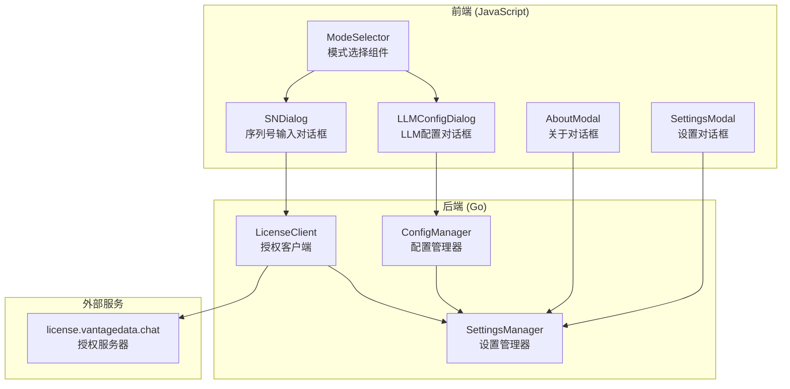
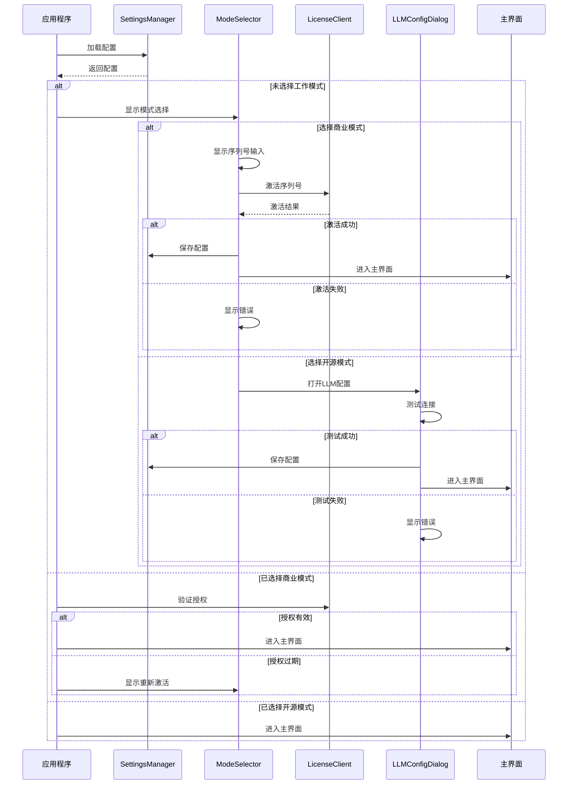

# 设计文档：启动模式选择

## 概述

本设计文档描述启动模式选择功能的技术实现方案。该功能允许用户在应用启动时选择商业软件模式或开源软件模式，并根据选择进行相应的配置和验证流程。

### 设计目标

1. 提供清晰的模式选择界面
2. 实现安全的商业授权激活流程
3. 支持开源模式的手动 LLM 配置
4. 确保配置的持久化存储
5. 根据模式动态调整界面显示

## 架构

### 整体架构



### 启动流程



## 组件和接口

### 1. 后端组件

#### 1.1 LicenseClient（授权客户端）

```go
// internal/license/client.go

package license

import (
    "crypto/aes"
    "crypto/cipher"
    "crypto/sha256"
    "encoding/base64"
    "encoding/json"
    "time"
)

const (
    LicenseServerURL = "https://license.vantagedata.chat"
)

// WorkMode 工作模式类型
type WorkMode string

const (
    WorkModeCommercial WorkMode = "commercial"
    WorkModeOpenSource WorkMode = "opensource"
)

// ActivationData 激活数据结构
type ActivationData struct {
    LLMType       string `json:"llm_type"`
    LLMBaseURL    string `json:"llm_base_url"`
    LLMAPIKey     string `json:"llm_api_key"`
    LLMModel      string `json:"llm_model"`
    ExpiresAt     string `json:"expires_at"`
    ActivatedAt   string `json:"activated_at"`
    DailyAnalysis int    `json:"daily_analysis"`
}

// ActivationResponse 激活响应
type ActivationResponse struct {
    Success       bool   `json:"success"`
    Code          string `json:"code"`
    Message       string `json:"message"`
    EncryptedData string `json:"encrypted_data,omitempty"`
    ExpiresAt     string `json:"expires_at,omitempty"`
}

// LicenseInfo 授权信息
type LicenseInfo struct {
    WorkMode      WorkMode       `json:"work_mode"`
    SerialNumber  string         `json:"serial_number,omitempty"`
    ActivationData *ActivationData `json:"activation_data,omitempty"`
    ActivatedAt   time.Time      `json:"activated_at,omitempty"`
}

// Client 授权客户端
type Client struct {
    serverURL string
}

// NewClient 创建授权客户端
func NewClient() *Client

// Activate 激活序列号
func (c *Client) Activate(serialNumber string) (*ActivationResponse, *ActivationData, error)

// RequestSN 通过邮箱申请序列号
func (c *Client) RequestSN(email string) (string, error)

// DecryptData 解密激活数据
func (c *Client) DecryptData(encryptedData, serialNumber string) (*ActivationData, error)

// ValidateSerialNumber 验证序列号格式
func (c *Client) ValidateSerialNumber(sn string) bool

// IsExpired 检查授权是否过期
func (c *Client) IsExpired(data *ActivationData) bool

// DaysUntilExpiry 计算距离过期的天数
func (c *Client) DaysUntilExpiry(data *ActivationData) int
```

#### 1.2 SettingsManager 扩展

```go
// internal/settings/settings.go 扩展

// LocalSettings 扩展
type LocalSettings struct {
    Token        string       `json:"token"`
    WorkMode     WorkMode     `json:"work_mode,omitempty"`
    LicenseInfo  *LicenseInfo `json:"license_info,omitempty"`
}

// GetWorkMode 获取工作模式
func (m *Manager) GetWorkMode() WorkMode

// SetWorkMode 设置工作模式
func (m *Manager) SetWorkMode(mode WorkMode) error

// GetLicenseInfo 获取授权信息
func (m *Manager) GetLicenseInfo() *LicenseInfo

// SetLicenseInfo 设置授权信息
func (m *Manager) SetLicenseInfo(info *LicenseInfo) error

// HasValidLicense 检查是否有有效授权
func (m *Manager) HasValidLicense() bool
```

#### 1.3 App 扩展（Wails 绑定）

```go
// app.go 扩展

// GetWorkMode 获取当前工作模式
func (a *App) GetWorkMode() string

// SetWorkMode 设置工作模式
func (a *App) SetWorkMode(mode string) error

// ActivateLicense 激活商业授权
func (a *App) ActivateLicense(serialNumber string) (*ActivationResult, error)

// RequestSerialNumber 申请序列号
func (a *App) RequestSerialNumber(email string) (string, error)

// GetLicenseInfo 获取授权信息（用于关于界面）
func (a *App) GetLicenseInfo() (*LicenseDisplayInfo, error)

// CheckLicenseValidity 检查授权有效性
func (a *App) CheckLicenseValidity() (*LicenseValidityResult, error)

// ActivationResult 激活结果
type ActivationResult struct {
    Success   bool   `json:"success"`
    Message   string `json:"message"`
    ExpiresAt string `json:"expires_at,omitempty"`
}

// LicenseDisplayInfo 授权显示信息
type LicenseDisplayInfo struct {
    WorkMode      string `json:"work_mode"`
    ExpiresAt     string `json:"expires_at,omitempty"`
    DailyLimit    int    `json:"daily_limit,omitempty"`
    DaysRemaining int    `json:"days_remaining,omitempty"`
    IsExpiringSoon bool  `json:"is_expiring_soon,omitempty"`
}

// LicenseValidityResult 授权有效性检查结果
type LicenseValidityResult struct {
    IsValid       bool   `json:"is_valid"`
    IsExpired     bool   `json:"is_expired"`
    IsExpiringSoon bool  `json:"is_expiring_soon"`
    Message       string `json:"message"`
}
```

### 2. 前端组件

#### 2.1 模式选择模态框

```html
<!-- frontend/index.html 新增 -->

<!-- 模式选择模态框 -->
<div id="mode-selection-modal" class="modal-overlay">
    <div class="modal mode-selection-modal">
        <div class="modal-header">
            <h2>选择工作模式</h2>
        </div>
        <div class="modal-body">
            <p class="mode-intro">请选择您的软件使用模式：</p>
            
            <div class="mode-options">
                <div class="mode-option" id="mode-commercial">
                    <div class="mode-icon">🏢</div>
                    <div class="mode-info">
                        <h3>商业软件模式</h3>
                        <p>使用序列号激活，自动获取 LLM 配置</p>
                        <ul>
                            <li>无需手动配置 API</li>
                            <li>专业技术支持</li>
                            <li>定期更新维护</li>
                        </ul>
                    </div>
                </div>
                
                <div class="mode-option" id="mode-opensource">
                    <div class="mode-icon">🌐</div>
                    <div class="mode-info">
                        <h3>开源软件模式</h3>
                        <p>手动配置您自己的 LLM API</p>
                        <ul>
                            <li>使用自己的 API 密钥</li>
                            <li>完全自主控制</li>
                            <li>社区支持</li>
                        </ul>
                    </div>
                </div>
            </div>
        </div>
    </div>
</div>

<!-- 序列号输入模态框 -->
<div id="serial-number-modal" class="modal-overlay">
    <div class="modal serial-number-modal">
        <div class="modal-header">
            <h2>激活商业授权</h2>
            <button class="modal-close" id="sn-modal-close">&times;</button>
        </div>
        <div class="modal-body">
            <div class="form-group">
                <label for="serial-number-input">序列号</label>
                <input type="text" id="serial-number-input" 
                       placeholder="XXXX-XXXX-XXXX-XXXX"
                       maxlength="19">
                <p class="hint">请输入您的序列号，格式：XXXX-XXXX-XXXX-XXXX</p>
            </div>
            
            <div id="sn-error" class="error-message" style="display: none;"></div>
            
            <div class="sn-actions">
                <button class="btn btn-primary" id="btn-activate">激活</button>
                <button class="btn btn-secondary" id="btn-request-sn">申请序列号</button>
            </div>
            
            <div id="email-request-section" style="display: none;">
                <div class="form-group">
                    <label for="email-input">邮箱地址</label>
                    <input type="email" id="email-input" placeholder="your@email.com">
                </div>
                <button class="btn btn-primary" id="btn-submit-email">提交申请</button>
            </div>
        </div>
        <div class="modal-footer">
            <button class="btn btn-secondary" id="btn-sn-back">返回</button>
        </div>
    </div>
</div>
```

#### 2.2 前端 JavaScript 模块

```javascript
// frontend/src/modeSelector.js

// 模式选择相关的后端绑定
let GetWorkMode, SetWorkMode, ActivateLicense, RequestSerialNumber, 
    GetLicenseInfo, CheckLicenseValidity;

// 初始化绑定
async function initModeBindings() {
    const App = await import('../wailsjs/go/main/App.js');
    GetWorkMode = App.GetWorkMode;
    SetWorkMode = App.SetWorkMode;
    ActivateLicense = App.ActivateLicense;
    RequestSerialNumber = App.RequestSerialNumber;
    GetLicenseInfo = App.GetLicenseInfo;
    CheckLicenseValidity = App.CheckLicenseValidity;
}

// 检查启动模式
async function checkStartupMode() {
    const workMode = await GetWorkMode();
    
    if (!workMode) {
        // 未选择模式，显示选择界面
        showModeSelectionModal();
        return false;
    }
    
    if (workMode === 'commercial') {
        // 商业模式，验证授权
        const validity = await CheckLicenseValidity();
        if (!validity.is_valid) {
            if (validity.is_expired) {
                showLicenseExpiredDialog();
                return false;
            }
        }
        if (validity.is_expiring_soon) {
            showExpiryWarning(validity.message);
        }
    }
    
    return true;
}

// 显示模式选择模态框
function showModeSelectionModal() {
    const modal = document.getElementById('mode-selection-modal');
    modal.classList.add('visible');
    
    // 绑定选项点击事件
    document.getElementById('mode-commercial').onclick = () => {
        modal.classList.remove('visible');
        showSerialNumberModal();
    };
    
    document.getElementById('mode-opensource').onclick = () => {
        modal.classList.remove('visible');
        showLLMConfigForOpenSource();
    };
}

// 显示序列号输入模态框
function showSerialNumberModal() {
    const modal = document.getElementById('serial-number-modal');
    modal.classList.add('visible');
}

// 激活序列号
async function activateSerialNumber() {
    const snInput = document.getElementById('serial-number-input');
    const sn = snInput.value.trim().toUpperCase();
    
    // 验证格式
    if (!validateSNFormat(sn)) {
        showSNError('序列号格式无效，请检查后重试');
        return;
    }
    
    try {
        const result = await ActivateLicense(sn);
        if (result.success) {
            showToast('激活成功！', 'success');
            closeAllModals();
            // 进入主界面
            initMainInterface();
        } else {
            showSNError(result.message);
        }
    } catch (error) {
        showSNError('激活失败：' + error.message);
    }
}

// 验证序列号格式
function validateSNFormat(sn) {
    const pattern = /^[A-Z0-9]{4}-[A-Z0-9]{4}-[A-Z0-9]{4}-[A-Z0-9]{4}$/;
    return pattern.test(sn);
}

// 开源模式 LLM 配置
async function showLLMConfigForOpenSource() {
    // 打开设置模态框，聚焦到 LLM 配置
    const settingsModal = document.getElementById('settings-modal');
    settingsModal.classList.add('visible');
    
    // 设置取消按钮行为
    const cancelBtn = document.getElementById('btn-settings-cancel');
    cancelBtn.onclick = () => {
        showExitConfirmDialog();
    };
}

// 显示退出确认对话框
function showExitConfirmDialog() {
    showConfirmDialog(
        '确定要退出吗？',
        '退出确认',
        '退出',
        '取消'
    ).then(confirmed => {
        if (confirmed) {
            // 关闭应用
            window.runtime.Quit();
        }
    });
}

// 更新关于界面的授权信息
async function updateAboutLicenseInfo() {
    const licenseInfo = await GetLicenseInfo();
    const licenseSection = document.getElementById('about-license-section');
    
    if (licenseInfo.work_mode === 'commercial') {
        licenseSection.style.display = 'block';
        document.getElementById('license-expires').textContent = licenseInfo.expires_at;
        document.getElementById('license-daily-limit').textContent = 
            licenseInfo.daily_limit > 0 ? licenseInfo.daily_limit + ' 次/天' : '无限制';
        
        if (licenseInfo.is_expiring_soon) {
            document.getElementById('license-warning').style.display = 'block';
            document.getElementById('license-warning').textContent = 
                `授权将在 ${licenseInfo.days_remaining} 天后过期，请及时续费`;
        }
    } else {
        licenseSection.style.display = 'none';
    }
}

// 根据模式调整设置界面
async function adjustSettingsForMode() {
    const workMode = await GetWorkMode();
    const llmSection = document.getElementById('llm-settings-section');
    
    if (workMode === 'commercial') {
        // 商业模式隐藏 LLM 配置
        llmSection.style.display = 'none';
    } else {
        // 开源模式显示 LLM 配置
        llmSection.style.display = 'block';
    }
}

export {
    initModeBindings,
    checkStartupMode,
    showModeSelectionModal,
    updateAboutLicenseInfo,
    adjustSettingsForMode
};
```

## 数据模型

### 配置文件结构

```json
{
  "token": "github_token_here",
  "work_mode": "commercial",
  "license_info": {
    "work_mode": "commercial",
    "serial_number": "XXXX-XXXX-XXXX-XXXX",
    "activation_data": {
      "llm_type": "openai",
      "llm_base_url": "https://api.openai.com/v1",
      "llm_api_key": "sk-xxx...",
      "llm_model": "gpt-4",
      "expires_at": "2025-12-31T23:59:59+08:00",
      "activated_at": "2024-06-01T10:30:00+08:00",
      "daily_analysis": 20
    },
    "activated_at": "2024-06-01T10:30:00+08:00"
  }
}
```

### 本地加密存储

商业模式的敏感数据（序列号、API 密钥）使用本地密钥加密存储：

```go
// 本地存储密钥派生
localKey := sha256.Sum256([]byte(serialNumber + "latex-translator-local-secret"))
```


## 正确性属性

*正确性属性是一种特征或行为，应该在系统的所有有效执行中保持为真——本质上是关于系统应该做什么的形式化陈述。属性作为人类可读规范和机器可验证正确性保证之间的桥梁。*

### Property 1: 启动模式检测一致性

*对于任意* 配置状态（无配置、商业模式、开源模式），启动时 Mode_Selector 应该根据配置状态正确决定是否显示模式选择界面或进入验证流程。

**Validates: Requirements 1.1, 1.2, 1.3, 1.4, 1.5**

### Property 2: 序列号格式验证

*对于任意* 字符串输入，License_Client 的序列号验证函数应该：
- 对于符合 XXXX-XXXX-XXXX-XXXX 格式（X 为字母或数字）的字符串返回 true
- 对于不符合格式的字符串返回 false

**Validates: Requirements 3.1, 3.2**

### Property 3: 激活数据解密往返

*对于任意* 有效的 ActivationData 对象和序列号，使用 SHA-256(序列号) 作为密钥进行 AES-256-GCM 加密后再解密，应该得到与原始数据等价的对象。

**Validates: Requirements 7.1, 7.2, 7.3**

### Property 4: 配置持久化往返

*对于任意* 有效的工作模式配置（包括工作模式、授权信息或 LLM 配置），保存到配置文件后再加载，应该得到与原始配置等价的数据。

**Validates: Requirements 6.1, 6.2, 6.3, 6.4**

### Property 5: 授权过期检测

*对于任意* 包含过期时间的 ActivationData，IsExpired 函数应该：
- 当过期时间早于当前时间时返回 true
- 当过期时间晚于当前时间时返回 false

**Validates: Requirements 8.1, 8.2**

### Property 6: 即将过期提醒

*对于任意* 包含过期时间的 ActivationData，DaysUntilExpiry 函数应该返回正确的天数，且当天数 <= 7 时应触发续费提醒。

**Validates: Requirements 8.3**

### Property 7: 模式界面差异

*对于任意* 工作模式设置，设置界面应该：
- 商业模式下隐藏 LLM 配置选项
- 开源模式下显示 LLM 配置选项

**Validates: Requirements 9.1, 9.2, 9.3**

### Property 8: 关于界面授权信息显示

*对于任意* 工作模式设置，关于界面应该：
- 商业模式下显示授权信息区域
- 开源模式下隐藏授权信息区域

**Validates: Requirements 10.1, 10.6**

### Property 9: 退出确认流程

*对于任意* 用户在配置未完成时尝试退出的操作，系统应该显示退出确认对话框，且：
- 用户确认后关闭应用
- 用户取消后返回配置界面

**Validates: Requirements 5.1, 5.3, 5.4, 5.5**

### Property 10: 配置损坏恢复

*对于任意* 损坏或无效的配置文件，Settings_Manager 应该能够检测到并重新显示模式选择界面，而不是崩溃。

**Validates: Requirements 6.5**

## 错误处理

### 网络错误

| 错误场景 | 处理方式 |
|---------|---------|
| 无法连接授权服务器 | 显示"无法连接服务器，请检查网络连接"，允许重试 |
| 请求超时 | 显示"请求超时，请稍后重试"，设置 30 秒超时 |
| 服务器返回错误 | 显示服务器返回的错误信息 |

### 授权错误

| 错误码 | 错误信息 | 处理方式 |
|-------|---------|---------|
| INVALID_SN | 序列号无效 | 提示用户检查序列号 |
| SN_EXPIRED | 序列号已过期 | 提示用户续费或切换到开源模式 |
| SN_DISABLED | 序列号已被禁用 | 提示用户联系管理员 |
| ENCRYPT_FAILED | 加密失败 | 显示内部错误，建议重试 |
| INVALID_EMAIL | 无效的邮箱地址 | 提示用户检查邮箱格式 |

### 配置错误

| 错误场景 | 处理方式 |
|---------|---------|
| 配置文件损坏 | 重置配置，显示模式选择界面 |
| 解密失败 | 清除授权信息，要求重新激活 |
| LLM 连接测试失败 | 显示具体错误，保持配置对话框打开 |

## 测试策略

### 单元测试

1. **序列号格式验证测试**
   - 测试有效格式：`ABCD-1234-EFGH-5678`
   - 测试无效格式：空字符串、长度不对、缺少分隔符、包含非法字符

2. **解密函数测试**
   - 使用已知的加密数据和序列号测试解密
   - 测试错误的序列号导致解密失败

3. **过期检测测试**
   - 测试已过期的日期
   - 测试未过期的日期
   - 测试边界情况（今天过期）

4. **配置持久化测试**
   - 测试保存和加载商业模式配置
   - 测试保存和加载开源模式配置
   - 测试损坏配置的处理

### 属性测试

属性测试使用 Go 的 `testing/quick` 包或第三方库如 `gopter`。

1. **Property 2: 序列号格式验证**
   - 生成随机字符串测试验证函数
   - 最少 100 次迭代
   - Tag: **Feature: startup-mode-selection, Property 2: 序列号格式验证**

2. **Property 3: 解密往返**
   - 生成随机 ActivationData 和序列号
   - 加密后解密验证等价性
   - 最少 100 次迭代
   - Tag: **Feature: startup-mode-selection, Property 3: 激活数据解密往返**

3. **Property 4: 配置持久化往返**
   - 生成随机配置数据
   - 保存后加载验证等价性
   - 最少 100 次迭代
   - Tag: **Feature: startup-mode-selection, Property 4: 配置持久化往返**

4. **Property 5: 授权过期检测**
   - 生成随机过期时间
   - 验证 IsExpired 函数正确性
   - 最少 100 次迭代
   - Tag: **Feature: startup-mode-selection, Property 5: 授权过期检测**

### 集成测试

1. **启动流程测试**
   - 测试无配置时显示模式选择
   - 测试有效商业配置时直接进入主界面
   - 测试有效开源配置时直接进入主界面
   - 测试过期商业配置时显示重新激活

2. **UI 交互测试**
   - 测试模式选择界面的两个选项
   - 测试序列号输入和激活流程
   - 测试 LLM 配置和连接测试流程
   - 测试退出确认对话框

### 测试配置

```go
// 属性测试配置示例
func TestSerialNumberValidation(t *testing.T) {
    // Feature: startup-mode-selection, Property 2: 序列号格式验证
    config := quick.Config{
        MaxCount: 100,
    }
    
    f := func(s string) bool {
        client := license.NewClient()
        result := client.ValidateSerialNumber(s)
        
        // 验证结果与预期一致
        expected := isValidSNFormat(s)
        return result == expected
    }
    
    if err := quick.Check(f, &config); err != nil {
        t.Error(err)
    }
}
```
